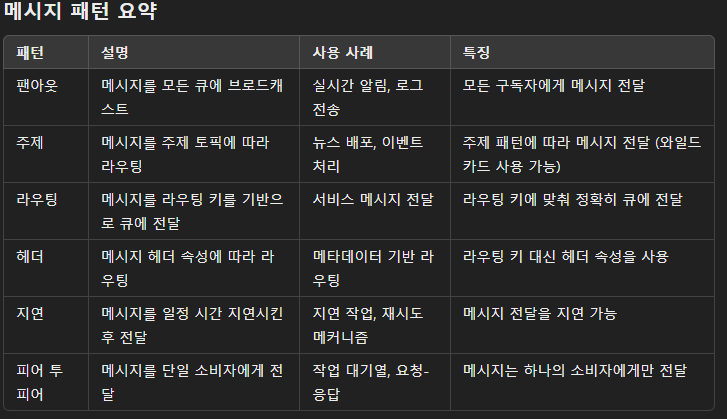

메시지 큐 시스템에서 다양한 메시지 패턴은 메시지를 특정 방식으로 전달하고 처리하기 위해 사용됩니다.

이러한 패턴은 시스템의 요구 사항에 따라 적합한 방식으로 메시지를 라우팅하고 전달할 수 있도록 돕습니다.

      주요 메시지 패턴에는 팬아웃, 주제, 라우팅 등이 있습니다.

#### 1. 팬아웃(Fanout)
   팬아웃 패턴은 메시지를 여러 소비자(Consumer)에게 동시에 브로드캐스트하는 방식입니다. 메시지가 한 번 발행(Publish)되면, 팬아웃 교환기(Exchange)는 해당 메시지를 모든 연결된 큐(Queue)로 전달합니다.

#### 사용 사례:
      로그 메시지의 실시간 전송
      알림 시스템
      멀티캐스트 시스템
#### 특징:
      메시지가 모든 구독자에게 전달됨
특정 조건 없이 모든 메시지를 브로드캐스트
#### 2. 주제(Topic)
   주제 패턴은 메시지를 특정 주제에 따라 라우팅하는 방식입니다. 메시지는 주제 토픽을 기반으로 큐에 전달되며, 각 큐는 특정 주제 패턴에 맞춰 구독합니다.

#### 사용 사례:
      뉴스 배포 시스템
      이벤트 기반 시스템에서 이벤트 타입별 처리
#### 특징:
      메시지는 토픽 패턴에 따라 라우팅됨
      와일드카드(*, #)를 사용하여 주제 패턴을 지정할 수 있음 (예: sport.*, tech.#)
#### 3. 라우팅(Direct)
   라우팅 패턴은 메시지를 특정 라우팅 키(Routing Key)를 사용하여 큐로 전달합니다. 발행자는 메시지를 특정 라우팅 키와 함께 발행하며, 교환기는 이 라우팅 키를 기반으로 적절한 큐로 메시지를 전달합니다.

#### 사용 사례:
      특정 서비스나 모듈로의 메시지 전달
      다중 채널 메시징 시스템
#### 특징:
      메시지는 정확한 라우팅 키에 맞춰 전달됨
      특정 큐로 메시지를 정확히 전달할 수 있음
#### 4. 헤더(Headers)
   헤더 패턴은 메시지의 헤더 속성에 따라 라우팅됩니다. 라우팅 키 대신 메시지 헤더의 속성을 사용하여 메시지를 전달할 큐를 결정합니다.

#### 사용 사례:
      메시지 메타데이터를 기반으로 한 라우팅
      복잡한 라우팅 규칙이 필요한 시스템
#### 특징:
      라우팅 키 대신 헤더 속성을 사용
      복잡한 조건을 기반으로 메시지를 라우팅 가능
#### 5. 지연(Delayed)
   지연 패턴은 메시지를 일정 기간 지연시킨 후 전달하는 방식입니다. 메시지는 지정된 시간 동안 대기하다가 소비자에게 전달됩니다.

#### 사용 사례:
      일정 시간이 지난 후 작업 실행
      재시도 메커니즘 구현
#### 특징:
      메시지 전달을 지연시킬 수 있음
      지연 시간 설정 가능
#### 6. 피어 투 피어(Point-to-Point)
   피어 투 피어 패턴은 메시지를 단일 소비자에게 전달하는 방식입니다. 각 메시지는 한 번만 소비되며, 메시지 큐는 여러 소비자 간에 메시지를 분배합니다.

#### 사용 사례:
      작업 대기열(작업을 여러 워커에게 분배)
      요청-응답 패턴
#### 특징:
      메시지는 하나의 소비자에게만 전달됨
      소비자 간의 작업 부하를 분산 가능

## 각 방식의 에러 처리

### 1. 구독자가 하나도 없는 경우
   이 경우 메시지가 발행되었지만 해당 메시지를 받을 구독자가 없는 상황입니다. 각 패턴에 대한 대응 방식을 살펴보겠습니다.

#### 팬아웃(Fanout) 패턴
#### 대응 방식:
팬아웃 패턴에서는 메시지가 모든 큐에 브로드캐스트되므로, 구독자가 없는 큐로 메시지가 전달되지 않더라도 다른 큐로는 전달될 수 있습니다.
대기 메시지 저장: 메시지를 임시 저장하거나 일정 시간 대기하는 메커니즘을 사용하여 나중에 구독자가 생겼을 때 전달할 수 있습니다.
#### 주제(Topic) 패턴
#### 대응 방식:
주제 패턴에서는 특정 주제에 맞는 구독자가 없는 경우 메시지가 소실될 수 있습니다.
대기 메시지 저장: 메시지를 일정 기간 저장하고 나중에 구독자가 생겼을 때 재전송하는 방법을 사용할 수 있습니다.
데드 레터 큐(Dead Letter Queue): 구독자가 없는 경우 메시지를 데드 레터 큐로 보내어 나중에 분석하거나 재처리할 수 있습니다.
#### 라우팅(Direct) 패턴
#### 대응 방식:
라우팅 키에 맞는 구독자가 없을 경우 메시지가 전달되지 않습니다.
대기 메시지 저장: 메시지를 일정 기간 저장하고 나중에 구독자가 생겼을 때 재전송하는 방법을 사용할 수 있습니다.
데드 레터 큐: 라우팅 키에 맞는 큐가 없을 경우 메시지를 데드 레터 큐로 보내어 나중에 처리할 수 있습니다.
#### 헤더(Headers) 패턴
#### 대응 방식:
헤더 속성에 맞는 구독자가 없을 경우 메시지가 전달되지 않습니다.
대기 메시지 저장: 메시지를 일정 기간 저장하고 나중에 구독자가 생겼을 때 재전송하는 방법을 사용할 수 있습니다.
데드 레터 큐: 헤더 조건에 맞는 큐가 없을 경우 메시지를 데드 레터 큐로 보내어 나중에 처리할 수 있습니다.
### 2. 실제로 전송 중에 서버상 문제로 실패한 경우
   이 경우 메시지가 발행되었으나 서버 오류로 인해 전송이 실패한 상황입니다. 메시지 브로커의 특성에 따라 대응 방식을 살펴보겠습니다.

#### 팬아웃(Fanout) 패턴
#### 대응 방식:
재시도 메커니즘: 메시지 전송 실패 시 일정 시간 후 재시도하는 메커니즘을 도입합니다.
대기 메시지 저장: 메시지를 임시 저장하고 서버가 복구되었을 때 다시 전송합니다.
백업 서버 사용: 이중화된 백업 서버를 통해 메시지를 재전송할 수 있습니다.
#### 주제(Topic) 패턴
#### 대응 방식:
재시도 메커니즘: 전송 실패 시 재시도하며, 일정 횟수 이상 실패 시 데드 레터 큐로 메시지를 보냅니다.
대기 메시지 저장: 메시지를 저장하고 나중에 서버가 복구되었을 때 재전송합니다.
백업 서버 사용: 이중화된 서버를 통해 메시지를 다시 전송할 수 있습니다.
#### 라우팅(Direct) 패턴
#### 대응 방식:
재시도 메커니즘: 메시지 전송 실패 시 재시도하며, 재시도 횟수를 설정하여 일정 횟수 이상 실패 시 데드 레터 큐로 메시지를 보냅니다.
대기 메시지 저장: 메시지를 임시 저장하고 서버가 복구되었을 때 다시 전송합니다.
백업 서버 사용: 이중화된 백업 서버를 통해 메시지를 재전송할 수 있습니다.
#### 헤더(Headers) 패턴
#### 대응 방식:
재시도 메커니즘: 메시지 전송 실패 시 일정 시간 후 재시도합니다.
대기 메시지 저장: 메시지를 저장하고 나중에 서버가 복구되었을 때 재전송합니다.
백업 서버 사용: 이중화된 서버를 통해 메시지를 다시 전송할 수 있습니다.
#### 공통적인 대응 방식
#### 데드 레터 큐(Dead Letter Queue):

메시지가 전달되지 않거나 여러 번 재시도 후 실패한 경우, 메시지를 데드 레터 큐로 보내어 나중에 분석하거나 처리할 수 있습니다.
지속성 메시지(Persistent Messages):

메시지를 디스크에 저장하여 시스템 장애 발생 시에도 메시지를 복구할 수 있습니다. 메시지를 영구적으로 저장하여 데이터 손실을 방지할 수 있습니다.
모니터링 및 알림:

메시지 전송 실패 시 모니터링 시스템을 통해 관리자에게 알림을 보내어 신속하게 문제를 해결할 수 있도록 합니다.
이중화 및 클러스터링:

메시지 브로커 서버를 이중화하거나 클러스터링하여 하나의 서버가 장애가 발생해도 다른 서버가 메시지를 처리할 수 있도록 합니다.

